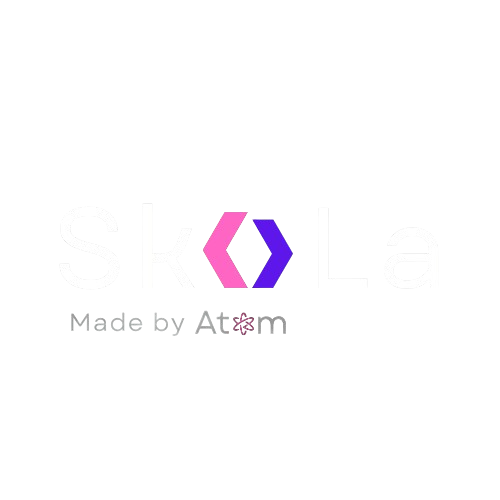

  

# SKYLA FRAMEWORK

  
  
  
  
  

---

## Overview
Skyla is a sophisticated **AI-driven cybersecurity framework** engineered for **autonomous vulnerability detection, exploitation, and threat intelligence analysis**. Designed for both **offensive and defensive security operations**, Skyla empowers professionals with advanced AI capabilities to proactively identify, assess, and neutralize security threats with **unparalleled efficiency and precision**.

---

## Core Capabilities

### Zero-Day Vulnerability Detection
- Utilizes **deep learning and advanced heuristics** to identify **previously unknown security flaws**.
- Maintains an **ultra-low false positive rate**, ensuring **97-100% accuracy**.
- Conducts **real-time vulnerability assessments** across multiple platforms.

### AUTOPWN System – Autonomous Exploitation
- Generates **intelligent attack logic** for real-world exploit scenarios.
- Performs **dynamic payload creation and automated execution**.
- Implements **real-time validation and risk assessment** post-exploitation.

### Intelligent Attack Vector Analysis
- Predicts and **maps potential attack surfaces dynamically**.
- Categorizes **high-risk vulnerabilities** for strategic mitigation.
- Detects **multi-stage attack chains** to expose intricate exploitation pathways.

### Application Security & Source Code Intelligence
- Conducts **static and dynamic AI-driven code analysis**.
- Detects **hidden security flaws and architectural vulnerabilities**.
- Supports multiple programming languages and frameworks for **comprehensive security auditing**.

### Live Threat Intelligence & External Database Integration
- Seamlessly integrates with industry-leading cybersecurity databases:
  - **National Vulnerability Database (NVD)**
  - **CVE Details & Exploit-DB**
  - **PacketStorm Security & Offensive Security**
- Enables real-time **threat intelligence gathering and correlation**.

### Continuous AI Evolution
- Adapts to **emerging security threats** through **self-improving models**.
- Utilizes **machine learning-enhanced risk assessments**.
- Requires **zero manual intervention**, ensuring full automation.

---

## External Tools & API Support
- **Seamless integration** with **penetration testing frameworks and security intelligence APIs**.
- Supports **custom AI modules** for extended analysis and automation.
- Implements **multi-layered encryption** and **network-based threat detection**.

---

## Why Choose Skyla?
- **Enterprise-Grade AI Security** – Built for **modern security professionals and enterprises**.
- **Autonomous Exploitation & Threat Analysis** – Reduces reliance on **manual attack surface research**.
- **Real-Time AI-Driven Security** – **Continuously adapts** to emerging threats.
- **Comprehensive Database & API Integrations** – Ensures **access to the latest security intelligence**.
- **Optimized for Red & Blue Teams** – Designed for both **offensive and defensive security strategies**.

---

## Official Website

  

---

### Developed by Atom
Skyla is a pioneering cybersecurity framework developed by **Atom**, a **cybersecurity expert specializing in AI-driven security automation, intelligent exploitation, and advanced cyber defense methodologies**.

> "Security isn’t just about defense—it’s about **understanding, anticipating, and controlling the attack**."

---

## SKYLA – THE FUTURE OF CYBERSECURITY INTELLIGENCE
