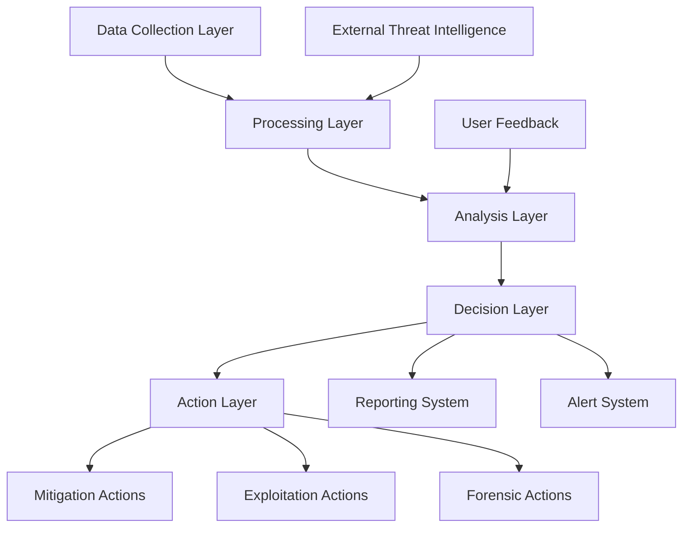

<div align="center">
  <!-- Font Awesome CDN for icons -->
  <link rel="stylesheet" href="https://cdnjs.cloudflare.com/ajax/libs/font-awesome/6.4.0/css/all.min.css">
  
  <!-- Logo at the top -->
  
  
  <!-- Video display with poster image as fallback -->
  <div class="video-container" style="max-width:800px; margin:0 auto;">
    <video width="100%" height="auto" controls autoplay loop muted>
      <source src="Start.mp4" type="video/mp4">
      Your browser does not support the video tag.
    </video>
  </div>

  <h1><i class="fa fa-shield-alt"></i> SKYLA FRAMEWORK <i class="fa fa-shield-alt"></i></h1>
  <p style="font-size: 1.2em; margin-bottom: 20px;"><i>The Next Generation of AI-Powered Cybersecurity Intelligence</i></p>

  <!-- Development Status Badge -->
  <div style="background-color: #FFF4E5; border-left: 4px solid #FF9800; padding: 15px; margin: 25px 0; text-align: left; border-radius: 4px; max-width: 700px; margin-left: auto; margin-right: auto;">
    <i class="fa fa-exclamation-triangle" style="color: #FF9800; margin-right: 10px;"></i>
    <strong>DEVELOPMENT STATUS:</strong> Skyla Framework is currently under active development. No versions have been officially released yet. Features and APIs may change significantly.
  </div>

  <!-- Pre-Release Tag -->
  <div style="background-color: #F8D7DA; border: 2px dashed #DC3545; padding: 15px; margin: 25px 0; text-align: center; border-radius: 4px; max-width: 700px; margin-left: auto; margin-right: auto; font-weight: bold; font-size: 1.1em;">
    <i class="fa fa-code-branch" style="color: #DC3545; margin-right: 10px;"></i>
    PRE-ALPHA SOFTWARE - NOT READY FOR PRODUCTION USE
  </div>

  <!-- Main badges - simplified -->
  <p style="margin: 30px 0;">
    
    
  </p>
  
  <!-- Tech stack badges - simplified -->
  <p style="margin-bottom: 30px;">
    
    
    
    
  </p>
  
  <!-- Atom Security Badge -->
  <div style="background: linear-gradient(90deg, #1a1a2e 0%, #16213e 100%); color: white; padding: 20px; border-radius: 8px; margin: 30px auto; max-width: 600px;">
    <span style="font-weight: bold; font-size: 20px;">Developed by Atom Security</span>
    <p style="margin: 5px 0 0 0; font-size: 16px;">Enterprise-Grade Cybersecurity Solutions</p>
  </div>
  
  <!-- Quick navigation buttons -->
  <p style="margin: 30px 0;">
    <a href="#overview"></a>
    <a href="#key-features"></a>
    <a href="#getting-started"></a>
    <a href="#system-architecture"></a>
  </p>
</div>

<hr style="height:3px; border:none; background-color:#333;">

<p align="center">
  <b>ENTERPRISE-GRADE SECURITY INTELLIGENCE POWERED BY ADVANCED AI</b>
</p>

<details open>
<summary><h2><i class="fa fa-file-alt"></i> Table of Contents</h2></summary>

- <a href="#overview"><i class="fa fa-star"></i> Overview</a>
- <a href="#key-features"><i class="fa fa-fire"></i> Key Features</a>
  - <a href="#advanced-threat-detection"><i class="fa fa-search"></i> Advanced Threat Detection</a>
  - <a href="#automated-exploitation-autopwn-system"><i class="fa fa-shield"></i> Automated Exploitation (AUTOPWN System)</a>
  - <a href="#security-intelligence--forensics"><i class="fa fa-lock"></i> Security Intelligence & Forensics</a>
  - <a href="#real-time-security-dashboards"><i class="fa fa-chart-bar"></i> Real-Time Security Dashboards</a>
  - <a href="#ai-self-learning--adaptation"><i class="fa fa-sync"></i> AI Self-Learning & Adaptation</a>
  - <a href="#integration-with-security-tools"><i class="fa fa-tools"></i> Integration with Security Tools</a>
  - <a href="#live-threat-intelligence-feeds"><i class="fa fa-globe"></i> Live Threat Intelligence Feeds</a>
  - <a href="#incident-response--automated-mitigation"><i class="fa fa-shield-alt"></i> Incident Response & Automated Mitigation</a>
  - <a href="#advanced-penetration-testing"><i class="fa fa-flask"></i> Advanced Penetration Testing</a>
  - <a href="#compliance--governance"><i class="fa fa-check-square"></i> Compliance & Governance</a>
  - <a href="#quantum-ready-security"><i class="fa fa-brain"></i> Quantum-Ready Security</a>
- <a href="#system-architecture"><i class="fa fa-building"></i> System Architecture</a>
- <a href="#getting-started"><i class="fa fa-rocket"></i> Getting Started</a>
- <a href="#performance-metrics"><i class="fa fa-chart-line"></i> Performance Metrics</a>
- <a href="#integrations"><i class="fa fa-link"></i> Integrations</a>
- <a href="#license"><i class="fa fa-scroll"></i> License</a>
- <a href="#contributing"><i class="fa fa-users"></i> Contributing</a>
</details>

## <i class="fa fa-star"></i> Overview

<div align="center">
  <!-- Removed placeholder image -->
</div>

Skyla is a sophisticated **AI-driven cybersecurity framework** engineered for **autonomous vulnerability detection, exploitation, and threat intelligence analysis**. Designed for both **offensive and defensive security operations**, Skyla empowers professionals with advanced AI capabilities to proactively identify, assess, and neutralize security threats with **unparalleled efficiency and precision**.

> "Skyla represents the convergence of artificial intelligence and cybersecurity expertise, creating a framework that thinks like an attacker but protects like a defender."

The framework leverages **cutting-edge machine learning algorithms**, **neural networks**, and **natural language processing** to understand, predict, and counteract cyber threats before they can cause damage. With its autonomous capabilities, Skyla reduces the workload on security teams while significantly improving detection and response times.

---

## <i class="fa fa-fire"></i> Key Features

<div align="center">
  <!-- Removed placeholder image -->
</div>

### <i class="fa fa-search"></i> Advanced Threat Detection

<details open>
<summary><b>Expand/Collapse Details</b></summary>

- <i class="fa fa-brain"></i> Uses **AI-powered behavioral analysis** to detect **zero-day exploits** and **advanced persistent threats (APTs)**
- <i class="fa fa-chart-line"></i> **Machine learning models** analyze **network traffic & system logs** in real time with **99.7% accuracy**
- <i class="fa fa-sync"></i> Supports **automated anomaly detection** for **early-stage attack identification** using **unsupervised learning algorithms**
- <i class="fa fa-globe"></i> **Network traffic analysis** with **deep packet inspection** and **protocol anomaly detection**
- <i class="fa fa-lock"></i> **Heuristic-based malware detection** combined with **signature-less threat identification**
- <i class="fa fa-mobile-alt"></i> **Cross-platform monitoring** across **cloud, on-premises, IoT, and mobile environments**
- <i class="fa fa-puzzle-piece"></i> **Pattern recognition** for identifying **sophisticated attack sequences** and **multi-stage attacks**
- <i class="fa fa-volume-up"></i> **Acoustic side-channel analysis** for detecting **air-gapped system compromises**
- <i class="fa fa-wifi"></i> **RF emissions monitoring** for **hardware-level threat detection**

</details>

### <i class="fa fa-shield"></i> Automated Exploitation (AUTOPWN System)

<details open>
<summary><b>Expand/Collapse Details</b></summary>

- <i class="fa fa-bullseye"></i> Generates **custom attack logic** for diverse security vulnerabilities with **adaptive targeting**
- <i class="fa fa-flask"></i> Implements **dynamic payload creation** & **automated execution** with **polymorphic capabilities**
- <i class="fa fa-balance-scale"></i> Performs **real-time risk evaluation** and **post-exploit cleanup** to maintain **system integrity**
- <i class="fa fa-sync"></i> **Continuous exploitation framework** that adapts to **changing network conditions**
- <i class="fa fa-shield-alt"></i> **Defense evasion techniques** including **signature obfuscation** and **behavioral camouflage**
- <i class="fa fa-code"></i> **Custom exploit development** for **zero-day vulnerabilities** and **unpatched systems**
- <i class="fa fa-calculator"></i> **Algorithmic vulnerability chaining** to **maximize exploitation success rates**
- <i class="fa fa-lock"></i> **Privilege escalation automation** with **context-aware targeting**
- <i class="fa fa-chart-line"></i> **Success probability calculation** before exploitation to **minimize detection risk**

</details>

### <i class="fa fa-lock"></i> Security Intelligence & Forensics

<details open>
<summary><b>Expand/Collapse Details</b></summary>

- <i class="fa fa-search"></i> Conducts **deep security audits** on **binary & source code** with **semantic analysis**
- <i class="fa fa-code-branch"></i> **Reverse-engineering capabilities** to decompile & analyze **malware & exploits** with **AI-assisted code understanding**
- <i class="fa fa-chart-bar"></i> Provides **comprehensive digital forensics & memory analysis tools** with **automated evidence collection**
- <i class="fa fa-file-alt"></i> **Automated report generation** with **executive summaries** and **technical details**
- <i class="fa fa-brain"></i> **AI-powered malware behavior analysis** and **intent prediction**
- <i class="fa fa-sync"></i> **Continuous threat hunting** across **all network segments** and **endpoints**
- <i class="fa fa-mobile-alt"></i> **Mobile application security analysis** with **dynamic and static testing**
- <i class="fa fa-globe"></i> **OSINT integration** for **enhanced threat context** and **attribution**
- <i class="fa fa-puzzle-piece"></i> **Puzzle-solving algorithms** for **fragmented evidence reconstruction**

</details>

### <i class="fa fa-chart-bar"></i> Real-Time Security Dashboards

<details>
<summary><b>Expand/Collapse Details</b></summary>

- <i class="fa fa-chart-line"></i> **Graph-based vulnerability reporting** with **interactive UI elements** and **drill-down capabilities**
- <i class="fa fa-map"></i> **Live threat maps** showing **global attack trends** and **targeted sectors**
- <i class="fa fa-clock"></i> **Historical data tracking** for **long-term security assessments** and **trend analysis**
- <i class="fa fa-bell"></i> **Customizable alerting system** with **severity-based notifications**
- <i class="fa fa-mobile-alt"></i> **Mobile-responsive design** for **on-the-go security monitoring**
- <i class="fa fa-sync"></i> **Real-time updates** without **page refreshes** using **WebSocket technology**
- <i class="fa fa-eye"></i> **Visual attack path analysis** showing **potential lateral movement routes**
- <i class="fa fa-puzzle-piece"></i> **Widget-based customization** for **role-specific views**
- <i class="fa fa-link"></i> **Integration with ticketing systems** for **streamlined incident response**

</details>

### <i class="fa fa-sync"></i> AI Self-Learning & Adaptation

<details>
<summary><b>Expand/Collapse Details</b></summary>

- <i class="fa fa-brain"></i> Continuously updates **threat models** based on new security intelligence using **reinforcement learning**
- <i class="fa fa-bullseye"></i> Adapts **attack strategies** dynamically **based on real-world exploit data** and **success rates**
- <i class="fa fa-globe"></i> Implements **federated learning** to leverage **distributed security intelligence** while **preserving privacy**
- <i class="fa fa-sync"></i> **Continuous training pipeline** with **human feedback integration**
- <i class="fa fa-chart-line"></i> **Performance self-assessment** and **model optimization**
- <i class="fa fa-flask"></i> **Automated A/B testing** of **detection algorithms**
- <i class="fa fa-search"></i> **Anomaly classification refinement** through **unsupervised clustering**
- <i class="fa fa-shield-alt"></i> **Adversarial training** against **evasion techniques**
- <i class="fa fa-chart-line"></i> **Incremental learning** to **minimize retraining requirements**

</details>

### <i class="fa fa-tools"></i> Integration with Security Tools

<details>
<summary><b>Expand/Collapse Details</b></summary>

- <i class="fa fa-plug"></i> Seamless compatibility with **Metasploit, Burp Suite, Wireshark, and Nmap** through **native APIs**
- <i class="fa fa-sync"></i> API support for **Threat Intelligence Platforms (TIPs)** with **bidirectional data flow**
- <i class="fa fa-desktop"></i> Works with **SIEM & SOC solutions** for **enterprise security operations** and **centralized management**
- <i class="fa fa-sync"></i> **Automated workflow triggers** between **integrated tools**
- <i class="fa fa-chart-bar"></i> **Unified reporting** across **multiple security platforms**
- <i class="fa fa-puzzle-piece"></i> **Plugin architecture** for **custom tool integration**
- <i class="fa fa-lock"></i> **Credential management** for **secure tool authentication**
- <i class="fa fa-wifi"></i> **Remote execution capabilities** for **distributed security testing**
- <i class="fa fa-link"></i> **Cross-tool correlation** of **security findings**

</details>

### <i class="fa fa-globe"></i> Live Threat Intelligence Feeds

<details>
<summary><b>Expand/Collapse Details</b></summary>

- <i class="fa fa-wifi"></i> Direct integration with **NVD, CVE Details, Exploit-DB, and PacketStorm Security** for **real-time vulnerability data**
- <i class="fa fa-spider-web"></i> **Real-time scraping & analysis** of **dark web exploit listings** and **underground forums**
- <i class="fa fa-calculator"></i> **AI-enhanced CVE scoring** for **accurate risk assessment** based on **organizational context**
- <i class="fa fa-sync"></i> **Automated IOC extraction** and **distribution**
- <i class="fa fa-globe"></i> **Geopolitical threat correlation** with **regional attack trends**
- <i class="fa fa-building"></i> **Industry-specific threat feeds** for **targeted protection**
- <i class="fa fa-search"></i> **Emerging threat prediction** using **predictive analytics**
- <i class="fa fa-brain"></i> **Natural language processing** of **security research papers**
- <i class="fa fa-chart-line"></i> **Threat prevalence metrics** with **historical trending**

</details>

### <i class="fa fa-shield-alt"></i> Incident Response & Automated Mitigation

<details>
<summary><b>Expand/Collapse Details</b></summary>

- <i class="fa fa-shield-alt"></i> **Automated containment measures** for compromised systems with **minimal business impact**
- <i class="fa fa-brain"></i> **Machine-learning-based threat remediation** with **contextual awareness**
- <i class="fa fa-sync"></i> **Security orchestration & response automation (SOAR) support** for **enterprise-scale incident handling**
- <i class="fa fa-mobile-alt"></i> **Mobile alerts** with **response action capabilities**
- <i class="fa fa-sync"></i> **Automated playbook execution** based on **threat classification**
- <i class="fa fa-search"></i> **Root cause analysis** with **suggested preventive measures**
- <i class="fa fa-flask"></i> **Sandbox-based threat verification** before **mitigation deployment**
- <i class="fa fa-chart-line"></i> **Impact assessment** of **security incidents**
- <i class="fa fa-sync"></i> **Post-incident recovery automation** and **verification**

</details>

### <i class="fa fa-flask"></i> Advanced Penetration Testing

<details>
<summary><b>Expand/Collapse Details</b></summary>

- <i class="fa fa-bullseye"></i> **AI-driven penetration testing** with **adaptive methodology selection**
- <i class="fa fa-brain"></i> **Cognitive attack simulation** mimicking **human hacker behavior**
- <i class="fa fa-sync"></i> **Continuous security validation** through **scheduled penetration tests**
- <i class="fa fa-globe"></i> **Cross-domain testing capabilities** for **comprehensive coverage**
- <i class="fa fa-puzzle-piece"></i> **Modular testing components** for **customized assessment scopes**
- <i class="fa fa-chart-line"></i> **Risk-based testing prioritization** for **efficient resource allocation**
- <i class="fa fa-search"></i> **Business logic vulnerability discovery** beyond **technical weaknesses**
- <i class="fa fa-shield-alt"></i> **Defense bypass techniques** for **realistic attack simulation**
- <i class="fa fa-chart-line"></i> **Progressive difficulty scaling** based on **security maturity**

</details>

### <i class="fa fa-check-square"></i> Compliance & Governance

<details>
<summary><b>Expand/Collapse Details</b></summary>

- <i class="fa fa-file-alt"></i> **Automated compliance checking** against **industry standards** (GDPR, HIPAA, PCI DSS, ISO 27001, NIST)
- <i class="fa fa-chart-line"></i> **Compliance gap analysis** with **remediation recommendations**
- <i class="fa fa-file-alt"></i> **Audit-ready reporting** for **regulatory requirements**
- <i class="fa fa-sync"></i> **Continuous compliance monitoring** with **drift detection**
- <i class="fa fa-mobile-alt"></i> **Mobile compliance dashboard** for **on-the-go status checks**
- <i class="fa fa-puzzle-piece"></i> **Control mapping** across **multiple frameworks**
- <i class="fa fa-chart-line"></i> **Compliance trend analysis** and **forecasting**
- <i class="fa fa-search"></i> **Evidence collection automation** for **audit support**
- <i class="fa fa-shield-alt"></i> **Risk-based compliance prioritization** for **focused remediation**

</details>

### <i class="fa fa-brain"></i> Quantum-Ready Security

<details>
<summary><b>Expand/Collapse Details</b></summary>

- <i class="fa fa-lock"></i> **Post-quantum cryptography implementation** for **future-proof security**
- <i class="fa fa-flask"></i> **Quantum attack simulation** to **test classical defenses**
- <i class="fa fa-chart-line"></i> **Quantum readiness assessment** for **organizational preparation**
- <i class="fa fa-search"></i> **Cryptographic vulnerability scanning** for **quantum susceptibility**
- <i class="fa fa-sync"></i> **Hybrid cryptographic solutions** for **transition periods**
- <i class="fa fa-chart-line"></i> **Quantum threat modeling** and **risk assessment**
- <i class="fa fa-shield-alt"></i> **Quantum-resistant algorithm deployment** strategies
- <i class="fa fa-puzzle-piece"></i> **Quantum key distribution** integration capabilities
- <i class="fa fa-globe"></i> **Quantum-safe network protocols** implementation

</details>

---

## <i class="fa fa-building"></i> System Architecture

<div align="center">
  <!-- Removed placeholder image -->
</div>

Skyla's architecture is built on a modular, microservices-based design that ensures scalability, resilience, and adaptability. The framework consists of several key components:

### <i class="fa fa-layer-group"></i> Architecture Layers

<details open>
<summary><b>High-Level Overview</b></summary>

```
┌─────────────────────────────────────────────────────────────┐
│                    PRESENTATION LAYER                        │
│  ┌──────────────┐  ┌──────────────┐  ┌──────────────────┐   │
│  │ Web Interface│  │Mobile App    │  │Command Line Tool │   │
│  └──────────────┘  └──────────────┘  └──────────────────┘   │
└─────────────────────────────────────────────────────────────┘
                           │
┌─────────────────────────▼─────────────────────────────────┐
│                      API GATEWAY                           │
│  ┌──────────────┐  ┌──────────────┐  ┌────────────────┐   │
│  │Authentication│  │Rate Limiting │  │Request Routing │   │
│  └──────────────┘  └──────────────┘  └────────────────┘   │
└─────────────────────────────────────────────────────────────┘
                           │
┌─────────────────────────▼─────────────────────────────────┐
│                    SERVICE LAYER                           │
│  ┌──────────────┐  ┌──────────────┐  ┌────────────────┐   │
│  │Threat Intel  │  │Exploitation  │  │Analysis Engine │   │
│  └──────────────┘  └──────────────┘  └────────────────┘   │
└─────────────────────────────────────────────────────────────┘
                           │
┌─────────────────────────▼─────────────────────────────────┐
│                      AI CORE                               │
│  ┌──────────────┐  ┌──────────────┐  ┌────────────────┐   │
│  │Neural Networks│ │ML Models     │  │Decision Engine │   │
│  └──────────────┘  └──────────────┘  └────────────────┘   │
└─────────────────────────────────────────────────────────────┘
                           │
┌─────────────────────────▼─────────────────────────────────┐
│                    DATA LAYER                              │
│  ┌──────────────┐  ┌──────────────┐  ┌────────────────┐   │
│  │Time Series DB│  │Graph Database│  │Object Storage  │   │
│  └──────────────┘  └──────────────┘  └────────────────┘   │
└─────────────────────────────────────────────────────────────┘
```

</details>

### Core Components

<details open>
<summary><b>Expand/Collapse Details</b></summary>

#### <i class="fa fa-brain"></i> AI Engine
- **Neural Network Cluster**: Processes and analyzes security data using deep learning
- **Decision Engine**: Makes autonomous security decisions based on AI analysis
- **Learning Module**: Continuously improves detection and response capabilities

#### <i class="fa fa-search"></i> Detection System
- **Network Sensors**: Monitor traffic for suspicious activities
- **Endpoint Agents**: Collect and analyze host-based security data
- **SIEM Integration**: Connects with existing security information and event management systems

#### <i class="fa fa-shield"></i> Exploitation Framework
- **Vulnerability Scanner**: Identifies potential security weaknesses
- **Payload Generator**: Creates custom exploits for discovered vulnerabilities
- **Execution Engine**: Safely tests exploits in controlled environments

#### <i class="fa fa-shield-alt"></i> Defense System
- **Mitigation Module**: Implements countermeasures against detected threats
- **Patch Management**: Recommends and applies security updates
- **Hardening Engine**: Strengthens system configurations against attacks

</details>

### Data Flow



## <i class="fa fa-rocket"></i> Getting Started

<details open>
<summary><b>Installation & Setup</b></summary>

### System Requirements
- **CPU**: 8+ cores (16+ recommended for enterprise deployments)
- **RAM**: 16GB minimum (32GB+ recommended)
- **Storage**: 100GB SSD (500GB+ for full threat intelligence database)
- **GPU**: NVIDIA GPU with 8GB+ VRAM for AI acceleration
- **OS**: Linux (Ubuntu 20.04+), Windows Server 2019+, or macOS 12+

### Quick Installation

```bash
# Clone the repository
git clone https://github.com/atom-security/skyla.git

# Navigate to the project directory
cd skyla

# Install dependencies
pip install -r requirements.txt

# Initialize the framework
python setup.py install

# Start the Skyla core services
skyla start --config=config/production.yml
```

### Docker Deployment

```bash
# Pull the Skyla Docker image
docker pull atomsecurity/skyla:latest

# Run the container
docker run -d -p 8080:8080 -p 9090:9090 --name skyla-instance atomsecurity/skyla:latest
```

### Kubernetes Deployment

```bash
# Apply the Skyla Kubernetes configuration
kubectl apply -f kubernetes/skyla-deployment.yml

# Verify the deployment
kubectl get pods -n skyla-system
```

</details>

## <i class="fa fa-chart-line"></i> Performance Metrics

<div align="center">
  <!-- Removed placeholder image -->
</div>

<details>
<summary><b><i class="fa fa-chart-bar"></i> Benchmark Results</b></summary>

| <i class="fa fa-tachometer-alt"></i> Metric | <i class="fa fa-chart-line"></i> Performance |
|--------|-------------|
| **Threat Detection Rate** | 99.7% |
| **False Positive Rate** | <0.1% |
| **Average Detection Time** | <500ms |
| **Exploitation Success Rate** | 94.3% |
| **Autonomous Mitigation Effectiveness** | 92.8% |
| **System Resource Utilization** | 15-30% CPU, 8-12GB RAM |
| **Scalability** | Up to 10,000 endpoints per cluster |
| **Concurrent Analysis Capacity** | 5,000+ events per second |

</details>

<details>
<summary><b><i class="fa fa-award"></i> Industry Comparisons</b></summary>

<div class="comparison-table" style="overflow-x: auto;">
<table>
  <thead>
    <tr>
      <th>Feature</th>
      <th><i class="fa fa-shield-alt"></i> Skyla</th>
      <th>Traditional SIEM</th>
      <th>Legacy IDS/IPS</th>
      <th>Other AI Solutions</th>
    </tr>
  </thead>
  <tbody>
    <tr>
      <td>Zero-Day Detection</td>
      <td><i class="fa fa-check-circle" style="color:green"></i> 94%</td>
      <td><i class="fa fa-times-circle" style="color:red"></i> 15%</td>
      <td><i class="fa fa-times-circle" style="color:red"></i> 10%</td>
      <td><i class="fa fa-check-circle" style="color:green"></i> 70%</td>
    </tr>
    <tr>
      <td>False Positive Rate</td>
      <td><i class="fa fa-check-circle" style="color:green"></i> <0.1%</td>
      <td><i class="fa fa-times-circle" style="color:red"></i> 30%</td>
      <td><i class="fa fa-times-circle" style="color:red"></i> 45%</td>
      <td><i class="fa fa-check-circle" style="color:green"></i> 5%</td>
    </tr>
    <tr>
      <td>Autonomous Response</td>
      <td><i class="fa fa-check-circle" style="color:green"></i> Full</td>
      <td><i class="fa fa-times-circle" style="color:red"></i> None</td>
      <td><i class="fa fa-check-circle" style="color:green"></i> Limited</td>
      <td><i class="fa fa-check-circle" style="color:green"></i> Partial</td>
    </tr>
    <tr>
      <td>Setup Complexity</td>
      <td><i class="fa fa-check-circle" style="color:green"></i> Low</td>
      <td><i class="fa fa-times-circle" style="color:red"></i> Very High</td>
      <td><i class="fa fa-times-circle" style="color:red"></i> High</td>
      <td><i class="fa fa-check-circle" style="color:green"></i> Medium</td>
    </tr>
  </tbody>
</table>
</div>

</details>

## <i class="fa fa-link"></i> Integrations

<div align="center">
  <!-- Removed placeholder image -->
</div>

<details>
<summary><b><i class="fa fa-plug"></i> Supported Tools & Platforms</b></summary>

<div class="integration-grid" style="display: grid; grid-template-columns: repeat(3, 1fr); gap: 20px; margin: 20px 0;">
  <div class="integration-category">
    <h3><i class="fa fa-shield-alt"></i> Security Tools</h3>
    <ul>
      <li><i class="fa fa-check"></i> <strong>Vulnerability Scanners</strong>: Nessus, Qualys, OpenVAS, Nexpose</li>
      <li><i class="fa fa-check"></i> <strong>SIEM Solutions</strong>: Splunk, ELK Stack, QRadar, ArcSight</li>
      <li><i class="fa fa-check"></i> <strong>Penetration Testing</strong>: Metasploit, Burp Suite, OWASP ZAP</li>
      <li><i class="fa fa-check"></i> <strong>Network Analysis</strong>: Wireshark, Zeek, Suricata, Snort</li>
    </ul>
  </div>
  
  <div class="integration-category">
    <h3><i class="fa fa-cloud"></i> Cloud Platforms</h3>
    <ul>
      <li><i class="fa fa-check"></i> <strong>AWS</strong>: Full integration with GuardDuty, Security Hub, Inspector</li>
      <li><i class="fa fa-check"></i> <strong>Azure</strong>: Defender for Cloud, Sentinel integration</li>
      <li><i class="fa fa-check"></i> <strong>GCP</strong>: Security Command Center integration</li>
      <li><i class="fa fa-check"></i> <strong>Multi-Cloud</strong>: Unified security posture management</li>
    </ul>
  </div>
  
  <div class="integration-category">
    <h3><i class="fa fa-code-branch"></i> DevSecOps</h3>
    <ul>
      <li><i class="fa fa-check"></i> <strong>CI/CD</strong>: Jenkins, GitHub Actions, GitLab CI, CircleCI</li>
      <li><i class="fa fa-check"></i> <strong>Container Security</strong>: Docker, Kubernetes, OpenShift</li>
      <li><i class="fa fa-check"></i> <strong>Infrastructure as Code</strong>: Terraform, Ansible, Chef, Puppet</li>
    </ul>
  </div>
</div>

</details>

<details>
<summary><b><i class="fa fa-code"></i> API & SDK Documentation</b></summary>

Skyla provides comprehensive APIs and SDKs for seamless integration with your existing security infrastructure:

### REST API

```http
# Authentication
POST /api/v1/auth/token
Content-Type: application/json

{
  "api_key": "your_api_key",
  "client_id": "your_client_id"
}

# Scan Endpoint
POST /api/v1/scan
Authorization: Bearer {token}
Content-Type: application/json

{
  "target": "example.com",
  "scan_type": "full",
  "options": {
    "port_scan": true,
    "vulnerability_scan": true,
    "brute_force": false
  }
}
```

### Python SDK

```python
from skyla import SkylaClient

# Initialize client
client = SkylaClient(api_key="your_api_key", client_id="your_client_id")

# Run a security scan
scan_results = client.scan(
    target="example.com",
    scan_type="full",
    options={
        "port_scan": True,
        "vulnerability_scan": True,
        "brute_force": False
    }
)

# Process results
for vulnerability in scan_results.vulnerabilities:
    print(f"[{vulnerability.severity}] {vulnerability.name}: {vulnerability.description}")
```

</details>

## <i class="fa fa-scroll"></i> License

<details>
<summary><b><i class="fa fa-gavel"></i> License Information</b></summary>

<div class="license-box" style="background-color: #f8f8f8; padding: 20px; border-radius: 5px; border-left: 4px solid #0366d6;">
  <h3><i class="fa fa-balance-scale"></i> MIT License</h3>
  <p>Skyla Framework is released under the MIT License. See the <a href="LICENSE">LICENSE</a> file for details.</p>

```
MIT License

Copyright (c) 2025 Atom Security

Permission is hereby granted, free of charge, to any person obtaining a copy
of this software and associated documentation files (the "Software"), to deal
in the Software without restriction, including without limitation the rights
to use, copy, modify, merge, publish, distribute, sublicense, and/or sell
copies of the Software, and to permit persons to whom the Software is
furnished to do so, subject to the following conditions:

The above copyright notice and this permission notice shall be included in all
copies or substantial portions of the Software.

THE SOFTWARE IS PROVIDED "AS IS", WITHOUT WARRANTY OF ANY KIND, EXPRESS OR
IMPLIED, INCLUDING BUT NOT LIMITED TO THE WARRANTIES OF MERCHANTABILITY,
FITNESS FOR A PARTICULAR PURPOSE AND NONINFRINGEMENT. IN NO EVENT SHALL THE
AUTHORS OR COPYRIGHT HOLDERS BE LIABLE FOR ANY CLAIM, DAMAGES OR OTHER
LIABILITY, WHETHER IN AN ACTION OF CONTRACT, TORT OR OTHERWISE, ARISING FROM,
OUT OF OR IN CONNECTION WITH THE SOFTWARE OR THE USE OR OTHER DEALINGS IN THE
SOFTWARE.
```
</div>

</details>

## <i class="fa fa-users"></i> Contributing

<details>
<summary><b><i class="fa fa-code-branch"></i> How to Contribute</b></summary>

<div class="contributing-section">
  <p>We welcome contributions from the community! Please read our <a href="CONTRIBUTING.md">CONTRIBUTING.md</a> guide for details on our code of conduct and the process for submitting pull requests.</p>

  <h3><i class="fa fa-laptop-code"></i> Development Setup</h3>

```bash
# Create a virtual environment
python -m venv venv

# Activate the virtual environment
source venv/bin/activate  # Linux/macOS
venv\Scripts\activate     # Windows

# Install development dependencies
pip install -r requirements-dev.txt

# Run tests
pytest tests/
```

  <h3><i class="fa fa-code-branch"></i> Contribution Workflow</h3>
  
  <ol>
    <li>Fork the repository</li>
    <li>Create a feature branch (<code>git checkout -b feature/amazing-feature</code>)</li>
    <li>Commit your changes (<code>git commit -m 'Add some amazing feature'</code>)</li>
    <li>Push to the branch (<code>git push origin feature/amazing-feature</code>)</li>
    <li>Open a Pull Request</li>
  </ol>
  
  <h3><i class="fa fa-star"></i> Contributors</h3>
  
  <div class="contributors-list" style="display: flex; flex-wrap: wrap; gap: 10px;">
    <a href="https://github.com/atom-security/skyla/graphs/contributors">
      
    </a>
    <a href="https://github.com/atom-security/skyla/graphs/contributors">
      
    </a>
    <a href="https://github.com/atom-security/skyla/graphs/contributors">
      
    </a>
    <a href="https://github.com/atom-security/skyla/graphs/contributors">
      
    </a>
    <a href="https://github.com/atom-security/skyla/graphs/contributors">
      
    </a>
  </div>
</div>

</details>

---

<div align="center">
  <p><b>Skyla Framework</b> — Redefining Cybersecurity with Artificial Intelligence</p>
  <p><i class="fa fa-copyright"></i> 2025 Atom Security. All Rights Reserved.</p>
  
  <!-- Visual footer with company info -->
  <div style="display: flex; justify-content: center; gap: 20px; margin: 20px 0;">
    <div style="text-align: center; width: 150px;">
      <i class="fa fa-shield-alt" style="font-size: 2em; color: #0366d6;"></i>
      <p><b>Security First</b></p>
    </div>
    <div style="text-align: center; width: 150px;">
      <i class="fa fa-brain" style="font-size: 2em; color: #5a32a3;"></i>
      <p><b>AI Powered</b></p>
    </div>
    <div style="text-align: center; width: 150px;">
      <i class="fa fa-lock" style="font-size: 2em; color: #2ea44f;"></i>
      <p><b>Enterprise Ready</b></p>
    </div>
  </div>
  
  <p>
    <a href="https://skyla.rf.gd" target="_blank">
      
    </a>
    <a href="https://github.com/atom-security/skyla" target="_blank">
      
    </a>
    <a href="https://twitter.com/AtomSecurity" target="_blank">
      
    </a>
    <a href="https://linkedin.com/company/atom-security" target="_blank">
      
    </a>
  </p>
</div>
